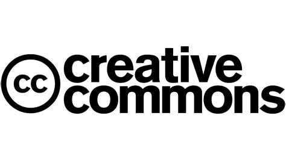

## Investigar e Pesquisar

### A Internet II
---

### Repositórios Digitais

- Um repositório é um **local onde conteúdos estão organizados**.
- Pode ter imagens, vídeos, textos, documentos ou arte.

---

### Para que servem?

- Encontrar conteúdos organizados por tema.
- Aceder a materiais com licença aberta.
- Pesquisar imagens ou documentos de forma segura.

---

### Exemplos de Repositórios

- Wikimedia Commons → imagens livres 
- Europeana → arte, cultura e história 
- Biblioteca Nacional Digital → livros e documentos
- Pexels / Unsplash → fotografias livres

---

### Como usar um repositório

- Procurar por tema.
- Filtrar resultados.
- Ver informação da imagem/documento.
- Confirmar a licença antes de usar.

---

### Licenças

- Muitos repositórios usam **Creative Commons**.
- Permitem reutilizar imagens ou textos de forma legal.

